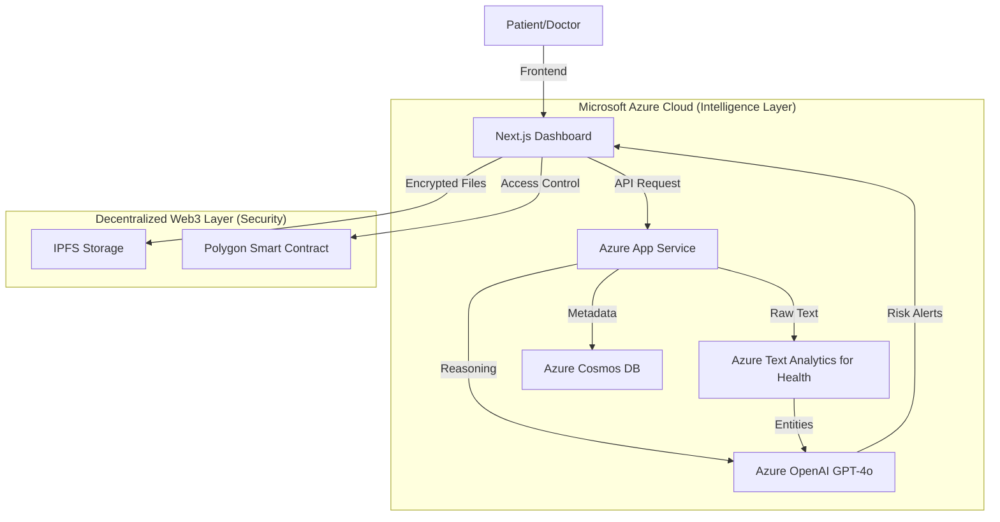

Here is the improvised **README.md** for **VitalVault AI**.

I have updated the technology stack to match the **Microsoft Azure AI** & **Polygon** architecture we defined earlier, refined the problem statement to be punchier, and highlighted the "Hero" features like the Emergency Break-Glass protocol.

---

# 🏥 VitalVault AI — Intelligent Clinical Copilot & Decentralized Record System

> **"AI-Powered Clinical Intelligence with Patient-Controlled Access."**
> *A secure, privacy-first platform that uses Microsoft Azure AI to transform scattered medical records into life-saving insights, while using Blockchain strictly for tamper-proof consent logging.*

## 🎯 Problem Statement

The modern healthcare ecosystem confronts a "Data Silo Crisis" that endangers patient lives:

* **❌ Data Fragmentation:** Patient history is trapped in isolated databases and unstructured PDFs, forcing doctors to hunt for context.
* **❌ Cognitive Overload:** Physicians spend **35% of their time** reviewing records, leading to burnout and missed critical details.
* **❌ Clinical Danger:** Lack of immediate history leads to fatal drug interactions and redundant, costly testing.
* **❌ Access Deadlock:** Patients are locked out of their own data, unable to share vital history during life-saving emergencies.

---

## ✨ The Solution: Trust + Intelligence

**VitalVault AI** replaces "trusting the hospital" with "trusting the architecture." We combine **Confidential Computing** with **Decentralized Control**.

### 1. 🛡️ The Intelligent Medical Vault

* **Unified History:** Aggregates lab reports, X-rays, and prescriptions into one secure, longitudinal record.
* **Privacy-First:** Data is encrypted (AES-256) and stored on **IPFS** (Decentralized Storage).
* **Azure Confidential Computing:** AI analysis occurs inside secure enclaves, ensuring data is never exposed in plain text during processing.

### 2. 🧠 AI Critical Risk Alerts (The "Hero" Feature)

Powered by **Azure AI Language (Text Analytics for Health)** & **GPT-4o**:

* **Active Flagging:** Automatically detects abnormal lab values (e.g., *"Creatinine spiked 20% since last visit"*).
* **Interaction Checks:** Cross-references new prescriptions against existing history to block dangerous drug interactions.
* **Structured Standardization:** Converts messy PDFs into standard FHIR-compatible JSON data.

### 3. 🚨 Emergency "Break-Glass" Protocol

* **Life-Saving Access:** In unconscious situations, verified ER doctors can trigger temporary access.
* **Immutable Audit:** The event is instantly logged on the **Polygon Blockchain** for transparency.
* **Instant Notification:** The patient and next of kin receive an immediate SMS/Email alert.

---

## 🏗️ System Architecture



---

## 🛠️ Technology Stack

### AI & Intelligence (Microsoft Stack)

| Technology | Purpose |
| --- | --- |
| **Azure OpenAI (GPT-4o)** | Complex medical reasoning, summarization, and trend analysis. |
| **Azure AI Language** | "Text Analytics for Health" for extracting meds, diagnoses, and dosages. |
| **Azure Confidential Computing** | Secure enclaves for processing sensitive data. |

### Blockchain & Storage

| Technology | Purpose |
| --- | --- |
| **Polygon PoS** | Low-cost, high-speed Smart Contracts for access control & audit logs. |
| **Solidity ^0.8.20** | Smart Contract logic (`AccessControl.sol`, `EmergencyLog.sol`). |
| **IPFS (Pinata)** | Encrypted, decentralized file storage for medical PDFs/Images. |
| **Wagmi / Viem** | React hooks for Web3 interaction. |

### Full Stack

| Technology | Purpose |
| --- | --- |
| **Next.js 14** | React Framework for SEO and server-side rendering. |
| **Tailwind CSS + Shadcn/ui** | Enterprise-grade medical UI components. |
| **Node.js / Express** | Backend API for orchestration. |
| **Azure Cosmos DB** | NoSQL database for non-sensitive application metadata. |

---

## 📂 Project Structure

```bash
VitalVault-AI/
│
├─ contracts/                 # Hardhat/Foundry Environment
│   ├── contracts/
│   │   ├── AccessControl.sol # Permission Logic (Patient -> Doctor)
│   │   ├── EmergencyLog.sol  # "Break-Glass" Audit Trail
│   │   └── Identity.sol      # DID Management
│   └── scripts/              # Deployment Scripts (Polygon Amoy)
│
├─ backend/                   # Node.js + Azure SDK
│   ├── src/
│   │   ├── controllers/      # AI orchestration logic
│   │   ├── services/
│   │   │   ├── azureAI.js    # GPT-4o & Text Analytics Config
│   │   │   └── ipfs.js       # Pinata Integration
│   │   └── routes/           # API Endpoints
│
└── frontend/                 # Next.js App
    ├── src/
    │   ├── components/       # Shadcn UI Components
    │   ├── app/
    │   │   ├── dashboard/    # Doctor Clinical View
    │   │   ├── vault/        # Patient Record View
    │   │   └── emergency/    # Break-Glass Trigger Page
    │   └── lib/              # Utils & Azure/Web3 Clients

```

---

## 🚀 Quick Start

### Prerequisites

* **Node.js 18+**
* **Azure Subscription** (OpenAI & Cognitive Services enabled)
* **Pinata Account** (For IPFS)
* **MetaMask** (Configured for Polygon Amoy Testnet)

### 1. Clone & Install

```bash
git clone https://github.com/yourusername/vitalvault-ai.git
cd vitalvault-ai
npm install

```

### 2. Environment Setup

Create a `.env.local` file in the root:

```env
# Microsoft Azure AI
AZURE_OPENAI_API_KEY=your_key
AZURE_OPENAI_ENDPOINT=your_endpoint
AZURE_LANGUAGE_KEY=your_text_analytics_key

# Blockchain & Storage
NEXT_PUBLIC_POLYGON_RPC=https://rpc-amoy.polygon.technology/
PINATA_API_KEY=your_pinata_key
PINATA_SECRET=your_pinata_secret

# Database
COSMOS_DB_CONNECTION_STRING=your_connection_string

```

### 3. Run the Development Server

```bash
npm run dev
# Open http://localhost:3000

```

### 4. Smart Contract Deployment

```bash
cd contracts
npx hardhat run scripts/deploy.js --network polygonAmoy
# Copy the contract address into your .env file

```

---

## 🤖 AI Workflow Example

**Input:** A 15-page PDF discharge summary uploaded by the patient.

1. **Ingestion:** File is encrypted -> uploaded to IPFS.
2. **Processing:**
* **Azure AI Language** extracts entities: `{"Medication": "Lisinopril", "Dosage": "10mg", "Frequency": "Daily"}`.
* **GPT-4o** analyzes context: *"Patient has history of hyperkalemia."*
3. **Display:** Doctor sees this flag immediately on the dashboard timeline.

---

## 📝 License

This project is licensed under the **MIT License**.

---

<p align="center">
<strong>⚡ VitalVault AI: Securing Health. Saving Time. Saving Lives. ⚡</strong>
</p>
